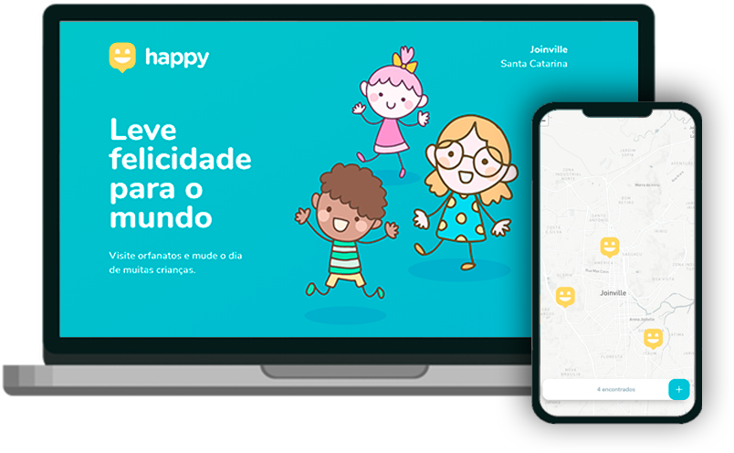
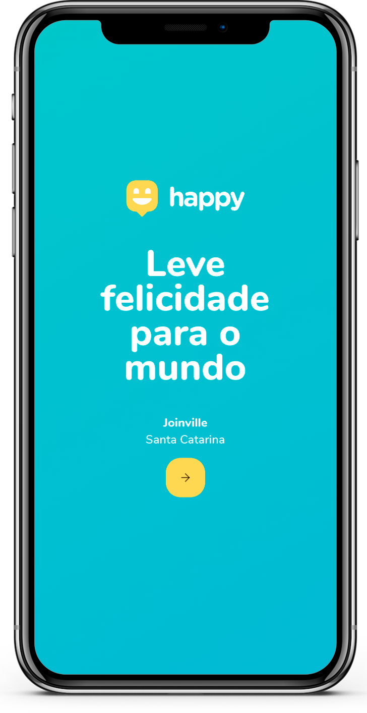
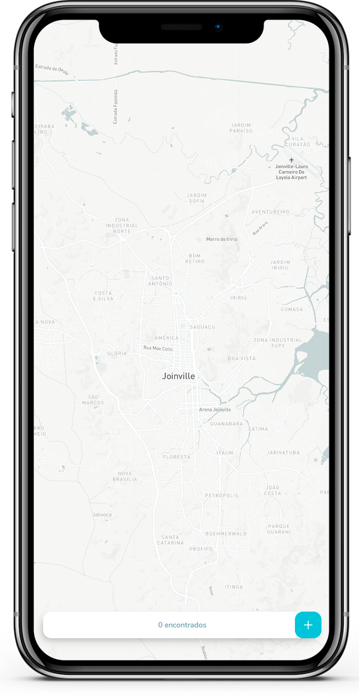
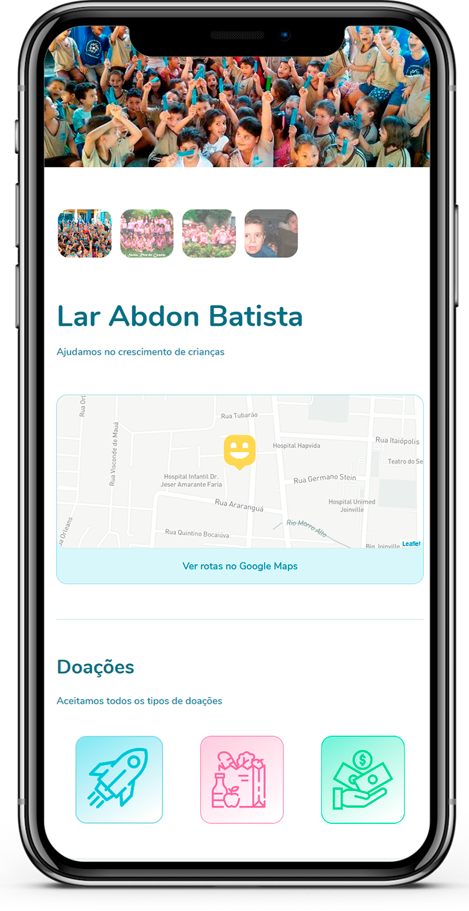
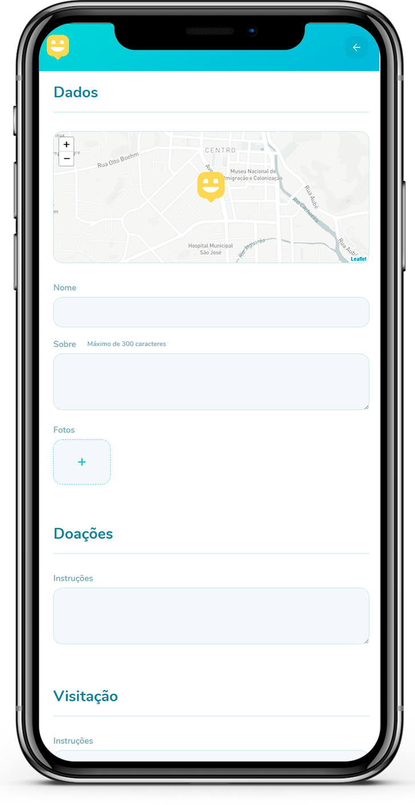

<h1 align="center">
    
</h1>

  <a href="https://nlw-03-happy.vercel.app">Deploy</a>

 

  

## 💻 Projeto

O Happy é uma aplicação criada pela Rocketseat, que conecta pessoas à casas de acolhimento institucional para fazer o dia de muitas crianças mais feliz 💜

## 🚀 Tecnologias

Esse projeto foi desenvolvido com as seguintes tecnologias:

- [Node.js](https://nodejs.org/en/)
- [React](https://reactjs.org)
- [React Native](https://facebook.github.io/react-native/)
- [Expo](https://expo.io/)
- [TypeScript](https://www.typescriptlang.org/)

## 🔝 Implementações

- Layout WEB responsivo 
  
 O foco da NLW é ir direto ao ponto dentro da stack, mas achei importante a implementaçao de um layout responsivo, pois grande parte das pessoas irão acessar a aplicação pelo smartfone 

    
- Campo para doações
   
 Alem de ajudarmos as crianças levando alegria e amor para elas, tambem podemos ajudar quando não estamos presencialmente no lar, atravez de doaçoes, pode ser um brinquedo, alimento ou ate mesmo uma ajuda financeira para ser revertida em beneficio das crianças 

   
<h2  align="center">
    
    
    
    
</h2>

Feito com ♥ by [Rocketseat](https://app.rocketseat.com.br/dashboard), [Carlos Molmelstet](https://github.com/carlosmolmelstet) e [Gabriela Liz](https://github.com/gabiliz)
